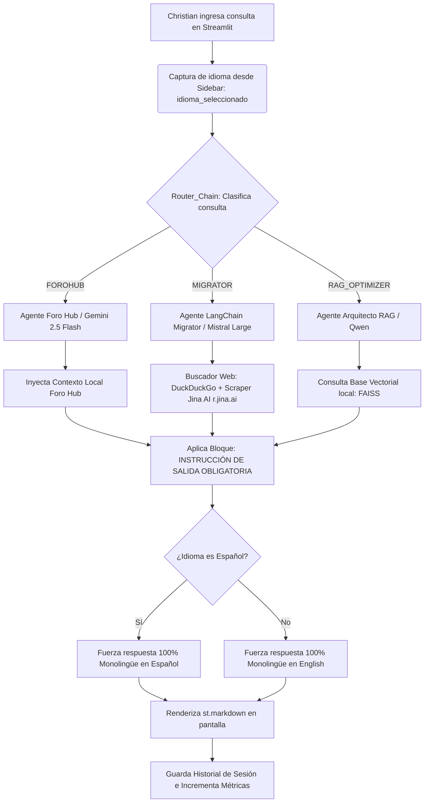

# 🤖 Agente de Infraestructura & Foro Hub (Frontend Chat)

Este repositorio contiene la interfaz de usuario interactiva desarrollada en **Streamlit** para interactuar con el Agente de Inteligencia Artificial enfocado en la infraestructura de **Foro Hub**. La aplicación implementa una arquitectura RAG (Retrieval-Augmented Generation) local para responder consultas técnicas precisas basándose en el entorno real de despliegue.

---

## 🛠️ Características Principales

*   **Interfaz de Chat Fluida:** Basada en los componentes nativos de chat de Streamlit para una experiencia limpia y responsiva.
*   **Contexto RAG de Infraestructura:** El agente consume el archivo `contexto_infraestructura.txt` para responder con datos reales del entorno sin recurrir a alucinaciones genéricas.
*   **Seguridad Anti-Bots (Honeypot Nativo):** Implementación de una trampa de seguridad oculta mediante un sistema de pestañas (`st.tabs`) asimétricas. El input de confirmación es invisible para usuarios humanos pero completamente expuesto para scrapers y bots automatizados, mitigando spam y ataques dirigidos.
*   **Despliegue Aislado:** Configurado para convivir de forma segura con entornos modernos de Python 3.13.

---

## 🏗️ Arquitectura del Entorno de Destino (Christian Dev)
El agente está entrenado para dar soporte sobre la siguiente arquitectura de infraestructura documentada en el contexto local:

* Servidor Web: Nginx actuando como proxy inverso en el puerto **8000**.

* SO del Servidor: Ubuntu Server alojado en la nube de Oracle Cloud Infrastructure (OCI) (Instancia Always Free).

* Cifrado: Certificados SSL administrados y renovados mediante Let's Encrypt y Certbot.

* Dominio Público: [https://foro-hub-christian.duckdns.org/api/swagger-ui/index.html](https://foro-hub-christian.duckdns.org/api/swagger-ui/index.html).

* Backend Relacionado: API REST desarrollada con Spring Boot 3.x y Java 21.

* Persistencia y Conexión de Datos: Base de datos Oracle Cloud (23ai/26ai) de alta disponibilidad (**@forohubdb_high**). Utiliza credenciales cifradas con Oracle Wallet dinámico mediante la siguiente configuración externalizada:
````
Properties
# CONFIGURACION DE CONEXION (ORACLE 26ai)
# ==========================================
# La ruta usa ${user.dir} para que funcione en cualquier PC donde descargues el proyecto
spring.datasource.url=jdbc:oracle:thin:@forohubdb_high?TNS_ADMIN=${TNS_ADMIN_PATH}
spring.datasource.username=ADMIN
spring.datasource.password=${DB_PASSWORD}
spring.datasource.driver-class-name=oracle.jdbc.OracleDriver

````

---

## 📁 Estructura de Archivos Clave

```text
├── agent_frontend.py          # Script principal de la aplicación Streamlit.
├── contexto_infraestructura.txt # Base de conocimiento RAG con la topología de la app.
├── README.md                  # Documentación del proyecto (este archivo).
└── requirements.txt           # Dependencias del entorno Python.
```

## 🚀 Cómo Ejecutar en Local

1. Requisitos Previos
* Python 3.11 o superior (**Testeado con éxito en Python 3.13**).

2. Clonación del Repositorio y Configuración del Entorno
Abre tu terminal y ejecuta los siguientes comandos para descargar el proyecto y aislar sus dependencias en un entorno virtual (`.venv`):

```
bash
# Clonar el repositorio
git clone [https://github.com/cris959/rag-updater-streamlit.git](https://github.com/cris959/rag-updater-streamlit.git)
cd rag-updater-streamlit
# Crear el entorno virtual (Venv)
python -m venv .venv

# Activar el entorno virtual
# En Windows (PowerShell):
.\.venv\Scripts\Activate.ps1
# En Linux/macOS:
source .venv/bin/activate

# Instalar los paquetes requeridos
pip install -r requirements.txt

```
1. Configurar la Base de Conocimiento
Asegurate de que el archivo **contexto_infraestructura.txt** contenga los datos actualizados del pipeline de despliegue, entidades JPA, reglas de negocio del foro y configuraciones del proxy inverso.

2. Lanzar la Aplicación
Ejecutá el servidor local de Streamlit:

```
Bash
streamlit run agent_frontend.py
```
Abre tu navegador en http://localhost:8501 para interactuar con el frontend.

## 🛡️ Seguridad: Implementación del Honeypot
Para evitar peleaduras con las restricciones de inyección de CSS/JS en iFrames aislados de las últimas versiones de Streamlit, la trampa anti-bots se despliega utilizando contenedores de layouts nativos:
````
Python
tab_principal, tab_sistema = st.tabs(["💬 Chat", " "])

with tab_principal:
    # Renderizado normal del historial de chat y chat_input
    pass

with tab_sistema:
    # Input trampa expuesto en el DOM pero fuera de la vista humana
    honeypot_field = st.text_input("Confirm email (dejar en blanco)", value="", key="email_confirm")
````
Si un script automatizado intenta rellenar masivamente los campos detectados en el DOM, el backend detectará que el valor de **key="email_confirm"** no está vacío y procederá a rechazar o bloquear la sesión del atacante.
___
# Segunda Etapa

# RAG Updater & Centro de Operaciones Multi-Agente 🚀

Este proyecto consiste en una aplicación interactiva desarrollada en **Streamlit** que implementa una arquitectura RAG (Retrieval-Augmented Generation) y un sistema de enrutamiento inteligente multi-agente. La plataforma asiste al desarrollador en tareas críticas de infraestructura, migración de código y optimización de bases vectoriales.

---

## 🛠️ Lo que hemos realizado hasta el momento

### 1. Arquitectura Multi-Agente Avanzada
Implementamos un flujo donde una cadena router (`router_chain`) analiza la consulta del desarrollador en milisegundos y la deriva dinámicamente al agente especialista ideal:
*   **Agente Foro Hub e Infraestructura Cloud (Gemini 2.5 Flash):** Diseñado específicamente para asistir en la gestión del backend de proyectos locales como Foro Hub, leyendo bases de conocimiento contextuales locales (`CONTEXTO_FOROHUB_TXT`).
*   **Agente LangChain Migrator (Buscador Web Avanzado + Mistral Large):** Especializado en la actualización viva de sintaxis de Python y LangChain. Implementa un pipeline híbrido de búsqueda: utiliza **DuckDuckGo API** para el descubrimiento de URLs oficiales y lo integra dinámicamente con el motor de **Jina AI Reader (`r.jina.ai`)**. Esto permite scrapear y transformar la documentación web compleja en Markdown ultra-limpio en tiempo real, garantizando que Mistral Large procese el código de refactorización con el contexto exacto de las últimas versiones de la librería.
*   **Agente Arquitecto RAG (FAISS + Qwen/DeepSeek):** Analiza estrategias complejas de fragmentación, embeddings y rendimiento consultando una base de datos vectorial local en `./data/rag_knowledge_base`.

### 2. Control de Idioma Infalible (Efecto Espejo UI)
Para solucionar la "inercia de tokens" en temas de DevOps (donde los modelos tendían a responder en inglés al procesar documentación técnica o bases vectoriales nativas en ese idioma), se integró un mecanismo de control desde la interfaz de usuario:
*   **Punto 1 (UI Selector):** Se añadió un componente `st.radio` en la barra lateral (`with st.sidebar`) para que el desarrollador defina de forma explícita el idioma de salida de la aplicación (*Español* / *English*).
*   **Punto 2 (Inyección de Prompt):** El pipeline intercepta la selección y concatena una instrucción mandatoria (`[INSTRUCCIÓN DE SALIDA OBLIGATORIA]`) con formato de bloques delimitados (`[...]`), forzando respuestas 100% monolingües sin importar el idioma del contexto inyectado.

### 3. Depuración del Entorno y API Updates
*   Se migraron los endpoints obsoletos o discontinuados de la API v1beta de Google hacia la familia **`gemini-2.5-flash`** para evitar errores `404 NOT_FOUND`.
*   Se implementaron filtros de advertencias (`warnings.filterwarnings`) para silenciar logs e interferencias de consola provocadas por el renombrado interno del paquete `duckduckgo_search` (`DDGS`).

---

## 🔄 Flujo de Funcionamiento (Pipeline Multi-Agente)

A continuación se detalla cómo interactúan los componentes desde que ingresas una consulta en la interfaz de Streamlit hasta que el agente especialista genera la respuesta en el idioma seleccionado:



## 💾 Gestión de Datos y Persistencia Local (`.gitignore`)

Para mantener el repositorio liviano, seguro y evitar la fuga de índices binarios pesados que cambian constantemente en el entorno de desarrollo, aplicamos una estrategia de desacoplamiento de datos:

*   **`data/` (Ignorado):** Esta carpeta contiene los índices vectoriales reales de FAISS (`index.faiss` e `index.pkl`) y las bases de datos ficticias de la app. **No se sube a GitHub**. Se genera y actualiza localmente en cada entorno ejecutando el script de inicialización.
*   **`data_ejemplo/` (Subido al Repo):** Contiene archivos de configuración y estructuras de muestra con consultas mock. Sirve como plantilla para que el pipeline sepa qué formato esperar al desplegar la aplicación desde cero.

### 🔄 Cómo regenerar la Base de Datos localmente
Si clonas el proyecto en un entorno nuevo (o al desplegar en el servidor Ubuntu de OCI), debés ejecutar el script de parseo y embeddings para reconstruir la carpeta `data/` y sus índices:

```
# Generar los índices FAISS locales en la carpeta /data
python actualizar_db.py
```
```
# Levantar el frontend interactivo con Streamlit
streamlit run agent_frontend.py
```
___

*   **Base de Datos de Transición (Mock/Local DB):** Configuramos una base de datos ficticia/local estructurada para simular el almacenamiento de credenciales, logs e historial de consultas. Este diseño desacoplado nos permite validar la lógica de los agentes y el comportamiento del backend localmente, garantizando una migración limpia y sin fricciones antes de conectar los servicios productivos una vez que subamos la aplicación a la infraestructura de **Oracle Cloud Infrastructure (OCI)**
___

## 🚀 Despliegue y Optimización (Entorno Dockerizado)

El Panel de Control Multi-Agente ha sido completamente contenedorizado utilizando **Docker** y **Docker Compose**, lo que garantiza un entorno de producción aislado, ligero y replicable, ideal para el despliegue en instancias "Always Free" de Oracle Cloud Infrastructure (OCI).

### 🛠️ Mejoras e Infraestructura Recientes

* **Optimización de Dependencias:** Se reestructuró el archivo `requirements-prod.txt` para solucionar conflictos de dependencias cruzadas con el ecosistema de LangChain (`ResolutionImpossible`). Además, se fijó una versión estable del conector de búsquedas (`duckduckgo-search`) libre de compiladores nativos de Rust (`cargo`/`maturin`), reduciendo drásticamente el peso y el tiempo de construcción de la imagen Docker.
* **Seguridad Avanzada** (Honeypot Anti-Bots): Se integró una trampa nativa invisible (**email_confirm**) para interceptar y bloquear scripts automatizados. El sistema de ocultamiento visual se fijó de forma quirúrgica mediante selectores avanzados de CSS (**div[data-testid="stTextInput"]:has(...)**) apuntando directamente al **placeholder** e **id** interno del componente. Esto garantiza que el Honeypot quede 100% aislado en las sombras dentro de Docker sin interferir con el renderizado reactivo ni bloquear el flujo de respuestas del chat principal.
* **Interfaz Bilingüe:** Se rediseñó el componente global de entrada de datos (`st.chat_input`), ofreciendo una experiencia de usuario (UX) más intuitiva que explicita el soporte nativo de procesamiento técnico tanto en **Español** como en **Inglés**.

## 🐳 Comandos de Gestión del Contenedor

Para levantar el entorno con las últimas optimizaciones de dependencias e interfaz, ejecutar en la raíz del proyecto:

```
bash
# Construir la imagen desde cero y levantar los servicios
docker compose up --build

# Levantar el contenedor en segundo plano (Modo producción)
docker compose up -d

# Detener los servicios por completo
docker compose down
```
___

## 🚀 Estado Actual del Despliegue en Producción

El proyecto se encuentra completamente desplegado, operativo y accesible de forma segura en un entorno de producción en la nube. 

### 🏗️ Arquitectura e Infraestructura Utilizada
* **Hosting:** Instancia ARM (Oracle Cloud Infrastructure - OCI) con sistema operativo Ubuntu Server.
* **Contenerización:** El frontend bilingüe de la aplicación está empaquetado y corriendo de forma aislada mediante **Docker** en el puerto interno `8501`.
* **Servidor Web y Proxy Inverso:** Se configuró **Nginx** para actuar como proxy inverso unificado. Esto permite que el backend (Java/Spring Boot - Foro Hub) y este nuevo frontend (Streamlit) convivan bajo el mismo dominio de forma armónica.
* **Seguridad y SSL:** Se implementaron certificados criptográficos de **Let's Encrypt (vía Certbot)**. Toda la comunicación externa está forzada mediante **HTTPS**.

### 🔗 Rutas de Acceso Configuradas
El servidor Nginx actúa como selector de rutas bajo el dominio principal:
* `https://foro-hub-christian.duckdns.org/` ➔ Direcciona al backend original en Java (`Foro Hub`).
* `https://foro-hub-christian.duckdns.org/rag/` ➔ Direcciona mediante WebSockets seguros al contenedor de **Streamlit (Agente RAG)** en el puerto `8501`.

### 🛡️ Medidas de Seguridad Aplicadas
1.  **Honeypot Integrado:** Se implementó una trampa silenciosa (campo oculto) en el frontend para detectar, invalidar y bloquear automáticamente solicitudes automatizadas de bots y scrapers malignos.
2.  **Firewall por Capas:** Tráfico regulado tanto a nivel interno del sistema operativo (`iptables` / `netfilter-persistent` en Ubuntu) como a nivel perimetral de la nube mediante las **Listas de Seguridad (Ingress Rules)** en la VCN de OCI para los puertos `80`, `443` y `8501`.
___


# RAG Intelligent Agent & Telemetry Hub 🚀

Este módulo implementa un sistema de **Generación Aumentada por Recuperación (RAG)** integrado con un Agente Inteligente, utilizando **Oracle Autonomous Database** en la nube como motor persistente y vectorial, y **Streamlit** como interfaz de usuario. 

El proyecto está completamente dockerizado y diseñado bajo estándares de seguridad para entornos productivos.

---

## 🛠️ Estado de la Arquitectura Actual

Actualmente, el sistema cuenta con las siguientes implementaciones clave:

*   **Motor Vectorial Nativo**: Conexión robusta en modo Thin a Oracle Cloud (OCI), validando la persistencia e indexación de fragmentos en la base de datos a través de la tabla `RAG_KNOWLEDGE_BASE`.
*   **Enrutamiento Inteligente (Decision Router)**: Implementación de lógica en el backend para la selección dinámica de modelos de Inteligencia Artificial según el contexto y complejidad de la consulta del usuario.
*   **Telemetría en Tiempo Real**: Sistema de auditoría integrado que registra cada interacción, modelo seleccionado y longitud de respuesta en la tabla `TELEMETRIA_AGENTES` para un monitoreo continuo del rendimiento del RAG.
*   **Infraestructura Desacoplada y Segura**: Dockerización completa del frontend y backend mediante `docker-compose`, aislando las credenciales mTLS de la Wallet de Oracle y centralizando la configuración mediante variables de entorno (`.env`).

---

## 🚀 Instrucciones de Despliegue Local

### 1. Requisitos Previos
*   Docker y Docker Compose instalados.
*   Descargar la Wallet de tu instancia de Oracle Autonomous Database.

### 2. Configuración del Entorno
Cloná el archivo de plantilla `.env.example` para crear tu configuración local sin exponer credenciales reales:

```
bash
cp .env.example .env
```

Asegurate de completar el **.env** con tus credenciales de OCI y colocar los archivos de tu Wallet descomprimidos dentro de la carpeta correspondiente en la raíz (la cual se encuentra protegida en el **.gitignore**):

* Ruta origen en la máquina: **/home/ubuntu/Wallet_forohubdb3**

* Ruta destino en el contenedor: **/app/oracle_wallet**

* Variable TNS_ADMIN: **/app/Wallet_forohubdb3**

⚠️ Nota de despliegue: El contenedor está configurado para reflejar y sincronizar el entorno seguro utilizando el mapeo directo de volúmenes y la variable de entorno TNS_ADMIN configurada de manera estática para la inicialización del cliente de Oracle.

3. Levantar la Aplicación
Para limpiar la caché del entorno y levantar el contenedor compilando la última versión del Agente, ejecutá:

```
Bash
docker compose down --remove-orphans
docker compose up --build -d
```

La interfaz de Streamlit quedará accesible de inmediato en el puerto http://localhost:8501.

## 🤝 ¿Cómo colaborar en el proyecto?
¡Toda ayuda para optimizar los agentes o mejorar el RAG es bienvenida! Para contribuir, sigue este flujo de trabajo estándar de Git:

1. Haz un **Fork** de este repositorio.

2. Crea una rama (Branch) para tu nueva funcionalidad o corrección de errores:

```
Bash
git checkout -b feature/nueva-funcionalidad
```
3. Realiza tus cambios en el código. Recuerda no incluir datos reales dentro de la carpeta **data/** y documentar tus preguntas de prueba en el archivo **banco_pruebas.json**.

4. Haz un Commit de tus cambios con un mensaje claro y descriptivo:

```
Bash
git commit -m "feat: agregar soporte para chunking semántico en RAG"
```
5. Sube tus cambios (Push) a tu repositorio remoto:

```
Bash
git push origin feature/nueva-funcionalidad
```
6. Abre un Pull Request (PR) detallando los cambios introducidos y qué problema resuelven para que lo revisemos y lo integremos a la rama **main**.


## 📝 Licencia
Este proyecto está bajo la Licencia MIT. Para más detalles, consulta el archivo [LICENSE](https://github.com/cris959/rag-updater-streamlit/blob/main/LICENSE.txt) adjunto en este repositorio.

Copyright © 2026 [Christian Garay](https://github.com/cris959/rag-updater-streamlit/blob/main/LICENSE.txt) - Backend Developer.
